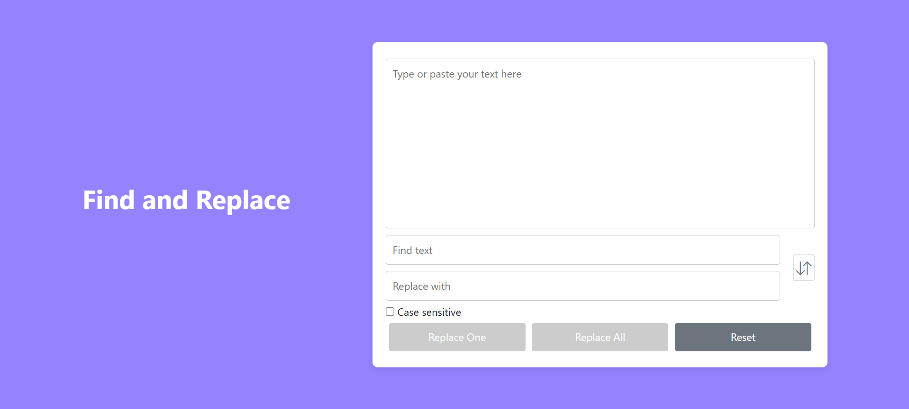

# Find and Replace Tool

This project is a simple web-based tool that allows users to find and replace words or phrases in a given text. The tool is implemented as a webpage with a text input area and interactive functionality for finding and replacing specified text.

---

## Features
- Text Input Area: A large text area where users can type or paste their text.
- Find and Replace: Fields to input the word/phrase to find and its replacement.
- Case Sensitivity Toggle: An optional checkbox to perform case-sensitive find and replace.
- Error Handling: Provides feedback for edge cases, such as empty inputs or words not found.
- Swap Text: Allows option to swap the entered text in find field and replace field.
- Replace One or All: Options to either replace the first occurence or replace all the occurences.

---

## How to Use
1. Paste or type the text into the provided text area.
2. Enter the word or phrase you want to find.
3. Enter the replacement word or phrase.
4. Click any of the Replace buttons to apply the changes.
5. The updated text will appear in the text area.

---

## Assumptions and Improvisations
- Case Sensitivity: The tool assumes a case-insensitive search by default. A toggle is provided to enable case-sensitive search.
- Replace One: The tool replaces only the first occurrence of the exact word/phrase entered in the "Find" fiel
- Replace All: The tool replaces all occurrences of the exact word/phrase entered in the "Find" field.
- Multi-line Input: The text area supports multi-line input for better usability.
- Real-time Feedback: The tool provides instant feedback if the word/phrase to be replaced is not found or in case of empty fields.

---

## Technology Stack
- HTML5: For structuring the webpage.
- CSS3 and Bootstrap: For styling the webpage.
- JavaScript: For implementing the core find-and-replace functionality and interactivity.

---

## Steps to Run the Project
1. Clone the repository:
   ```bash
   git clone https://github.com/ShreyaShirva/FindAndReplace.git
   ```
2. Navigate to the project directory:
   ```bash
   cd FindAndReplaceTool
   ```
3. Install Node.js and Angular CLI
    ```bash
    Ensure you have Node.js and Angular CLI installed. If not, download and install them:
        - Node.js: Download Node.js
        - Angular CLI: Install globally using npm:
            npm install -g @angular/cli
    ```
4. Install Dependencies
    ```bash
    npm install
    ```
5. Serve the application
    ```bash
    ng serve
    ```
6. Access the application
    ```bash
    - Open a web browser.
    - Navigate to http://localhost:4200.
    ```

# Screenshots

## Find and Replace Tool


---
